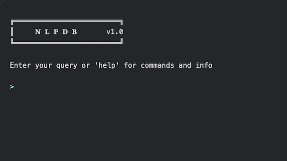

# nlpdb 🧠

A simple web app to interact with a MySQL database using natural language queries.



## ⚠️ WARNINGS ⚠️

- **This app is for development purposes only. It is not secure and should not be used in a production environment.**
- **It executes all queries directly against the database. It does not use any ORM or SQL builder.**
- **It does NOT prompt you for confirmation before executing queries.**

## Requirements

- Python 3.13+
- OpenAI API key
- MySQL database

## Setup

1. Clone the repository:

   ```bash
   git clone https://github.com/yourusername/nlpdb.git
   cd nlpdb
   ```

2. Create and configure environment:
   - Copy `.env_template` to `.env`
   - Fill in variables

3. Set up Python environment:

    ```bash
    python -m venv venv
    source venv/bin/activate
    pip install -r requirements.txt
    ```

## Usage

Any text that is not a command is passed to the LLM to be converted into a SQL query. This query is executed directly against the database and the results are displayed in the browser.

### Commands

| Command | Description |
|---------|-------------|
| `help` | Show the help message |
| `clear` | Clear the previous output from the terminal screen |
| `import` | Import a CSV file into the database |

### Examples

| Action | Command | Description |
|--------|---------|-------------|
| Display help | `help` | Display the help message |
| Clear screen | `clear` | Clear the previous output from the terminal screen |
| Import CSV | `import` | Import a CSV file into a table in the database matching file name |
| List databases | `show databases`, `get dbs`, `list dbs` | Show available databases |
| List tables | `show tables`, `get tables`, `list tables` | Show available tables |
| Get 50 rows from a table | `get 50 rows from ama_modifiers` | List x rows from a table |
